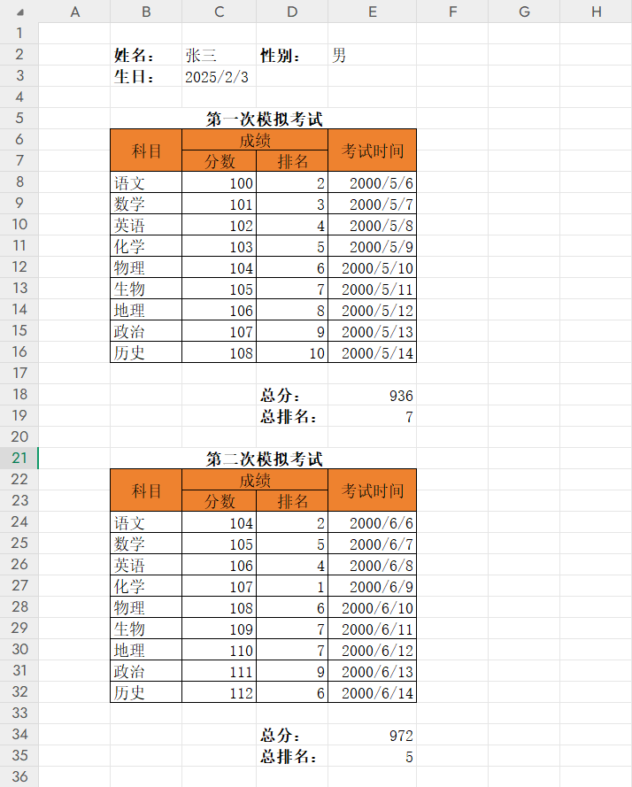

# ExcelTemplate

## 简介

本项目是一个 Excel 模版引擎，旨在解决工作中遇到的 Excel 模版导入导出问题，将 Excel 映射到对应的 .Net 类实体。之所以在前人已经造了诸多轮子的情况下，依然决定自己动手再造一遍轮子，是因为有以下这些痛点未能得到解决：

- 表单数据和列表数据混排
- 导入和导出双向模版
- 错误信息管理（重要）

## 详情
### 1.表单和列表数据混排

什么是表单和列表数据？

这是表单：

这是列表：

这是混排：

单纯的表单或列表，处理起来还是比较简单的，也有很多成熟的轮子。而当两者混排起来的话，就会变得稍微复杂一点。因为对于列表来说，通常情况下数据量是变化的，也就是说，在 Excel 表格里的实际占用的纵向高度是随着实际情况变化的，排在表格底下的其他数据，必然要被挤到更下面的空间，这使得模版设计时所指定的坐标，无论是表单还是列表，都不是固定不变的，这就要求必须拥有一定的自适应能力。

### 2.导入和导出双向模版

同一个模版，能同时支持导入和导出，特别是能在混排的情况下拥有双向能力。

### 3.错误信息管理（重要）

这是一个非常重要且有用的功能，也是我决定自己动手造轮子的一个重要推动力。

对于导入功能，往往会遇到实际导入的数据有错误的情况，或者不符合规范、或者不满足业务需要，我们要当作错误来进行处理，并提示给用户。

这时会有以下几个需求：

1. 输出错误信息的时，需要把错误信息定位到具体的 Excel 单元格坐标
2. 对于列表或者混排的情况，要能自动适应坐标偏移
3. 以一种 **简单** 且 **直观** 的方式进行错误信息的录入

在使用模版引擎把 Excel 映射到类实体后，不需要手动操作 Excel，带来了极大的方便，但也导致了进行错误处理时，变得更加麻烦。脱离了对 Excel 的手动精细操作，面对的是实体类的字段，这时候，当我们要从字段反向计算映射到 Excel 中的实际位置时，别是混排的情况下，将是一个十分麻烦的过程，反正肯定算不上 “**简单**” 和 “**直观**”。
而现在，我决定解决这个问题。

## 开发进度
### 已完成

- 从类型（Type）生成模版定义
- 根据模版从 Excel 读取数据生成类实体
- 根据模版从类实体渲染为 Excel
- 单元格错误提示管理功能
- 简单的样式支持

### 待完成

- 从 Excel 生成模版定义
- 自定义数据校验
- 自定义数据 Mapping