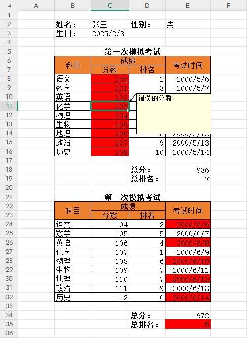

# 错误提示管理

## 实体定义

```CSharp
 public class PersonInfo
 {
     public string Name { get; set; }

     public List<OrderInfo> Orders { get; set; }
 }

 public class OrderInfo
 {
     public string OrderId { get; set; }

     public decimal Price { get; set; }
 }
```

## 生成提示信息

```CSharp
// 读取模版
var templateFileName = "...";
var template = Template.FromExcel(templateFileName);

// 读取数据，并返回提示信息生成器
var dataFileName = "...";
var builder = template.GetHintBuilder<PersonInfo>(dataFileName);

// 普通字段，直接添加错误提示
builder.For(a => a.Name).AddMessage("名称错误");

// 数组字段，foreach 通过 Pick(item) 元素定位
foreach (var item in builder.Data.Orders)
{
    builder.For(a => a.Orders.Pick(item).OrderId).AddMessage("错误的订单id");
    builder.For(a => a.Orders.Pick(item).Price).AddMessage("错误的订单价格");
}

// 数组字段，for 通过 Pick(i) 下标定位
for (var i = 0; i < builder.Data.Orders.Count; i++)
{
    builder.For(a => a.Orders.Pick(i).OrderId).AddMessage("错误的订单id");
    builder.For(a => a.Orders.Pick(i).Price).AddMessage("错误的订单价格");
}

// 设置错误提示颜色
builder.SetMessageBgColor("FF0000");

// 生成包含提示信息的 Excel 文件
var workbook = builder.BuildExcel();
workbook.Save("Temp/hit.xlsx");

// 获取读取到的数据
var data = builder.Data;
```

## 效果图参考

效果图是根据单元测试 HintBuilderTest.BuilderExpressionTest 生成

