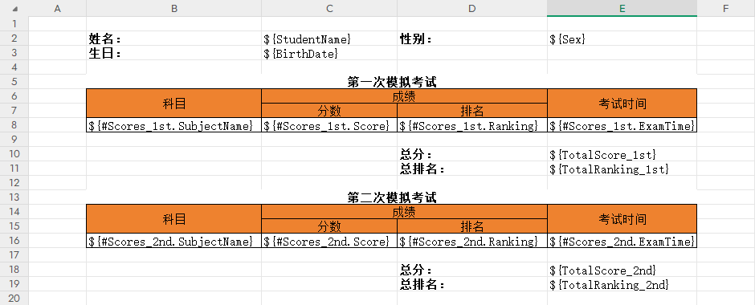

# 从 Excel 生成模板

## 定义模板

首先，我们得先有一个 Excel 文件，比如路径为 /template/abc.xlsx

```Csharp
var fileName = "/template/abc.xlsx";
```

内容为：



Form 类型使用 **\${fieldPath}** ，Table 使用 **\${#fieldPath}**

## fieldPath 的说明

fieldPath 指的是类实体字段的访问路径，比如上面的 Excel 内容，可以映射到的类结构如下：

```CSharp
internal class MixtureModel
{
    public string StudentName { get; set; }
    public string Sex { get; set; }
    public DateTime BirthDate { get; set; }
    public List<ScoreItem> Scores_1st { get; set; }
    public float TotalScore_1st { get; set; }
    public int TotalRanking_1st { get; set; }
    public List<ScoreItem> Scores_2nd { get; set; }
    public float TotalScore_2nd { get; set; }
    public int TotalRanking_2nd { get; set; }

    internal class ScoreItem
    {
        public string SubjectName { get; set; }
        public float Score { get; set; }
        public int Ranking { get; set; }
        public DateTime ExamTime { get; set; }
    }
}
```

对于数组字段 Scores_1st，也可以直接使用 Scores_1st.SubjectName 表示 fieldPath 。

实体类的定义只要结构能跟模板对应上即可，模板本身不会跟任何具体的实体类强绑定。

## 读取模版

```Csharp
var template = Template.FromExcel(fileName);

//或者
var template = new ExcelDesignAnalysis().DesignAnalysis(fileName);

// 或者，使用文件流读取
 using (var stream = File.OpenRead(fileName))
 {
     var template = new ExcelDesignAnalysis().DesignAnalysis(stream);
 }
```